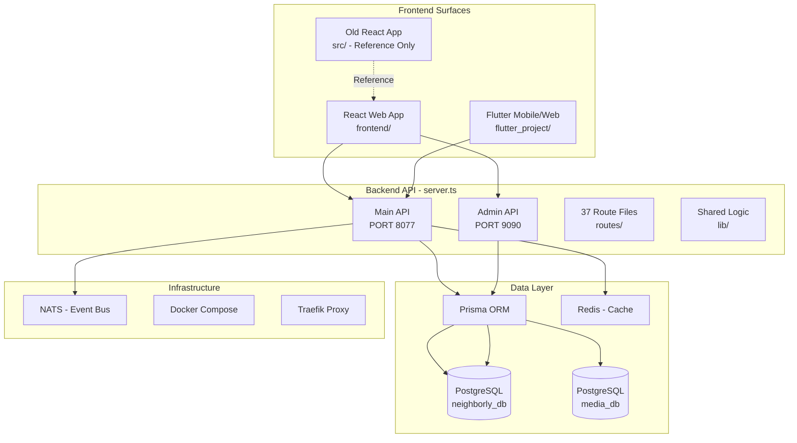

# Neighborly 2.0 — Agent Execution Plan

> **Version:** 2.0.0  
> **Last Updated:** 2026-05-14  
> **Purpose:** Detailed step-by-step instructions for AI agents to execute the Neighborly 2.0 implementation

---

## PRE-FLIGHT: READ THESE FILES FIRST

Before writing any code, read these files in this exact order:
1. [`plans/ROADMAP.md`](./ROADMAP.md) — Master roadmap with phase matrix
2. [`plans/FEATURES_CUSTOMER_DASHBOARD.md`](./FEATURES_CUSTOMER_DASHBOARD.md) — Customer dashboard features
3. [`plans/FEATURES_BUSINESS_DASHBOARD.md`](./FEATURES_BUSINESS_DASHBOARD.md) — Business dashboard features
4. [`plans/FEATURES_ADMIN_DASHBOARD.md`](./FEATURES_ADMIN_DASHBOARD.md) — Admin dashboard features
5. [`prisma/schema.prisma`](../prisma/schema.prisma) — Database schema (1073 lines)
6. [`server.ts`](../server.ts) — Backend entry point
7. [`src/pages/CustomerDashboard.tsx`](../src/pages/CustomerDashboard.tsx) — Reference: old customer dashboard
8. [`src/pages/AdminDashboard.tsx`](../src/pages/AdminDashboard.tsx) — Reference: old admin dashboard
9. [`src/pages/ProviderDashboard.tsx`](../src/pages/ProviderDashboard.tsx) — Reference: old provider dashboard
10. [`frontend/src/app/router.tsx`](../frontend/src/app/router.tsx) — New frontend routes
11. [`frontend/src/lib/api.ts`](../frontend/src/lib/api.ts) — New frontend API client

---

## CRITICAL RULES

1. **English only** in all code, comments, logs, commit messages, and documentation.
2. **Never delete database columns** — use `archivedAt` for soft-delete.
3. **All code must have tests** — unit coverage >= 70% for new code.
4. **SonarCloud must pass** — 0 blockers, 0 critical issues before merge.
5. **Use existing `src/` code as reference** — the old frontend has fully working implementations. Read, understand, and port logic to the new `frontend/` structure. Do NOT rewrite from scratch.
6. **Commit after each phase** — use the exact commit message provided.
7. **Run quality checks before each commit** — `npm run typecheck` and `npm run lint`.
8. **Update `plans/ROADMAP.md`** status when you complete a phase.

---

## PHASE 0 — CLEANUP & BOOTSTRAP

### Step 0.1 — Delete Junk Files

Run these commands from the repository root:

```bash
# Remove backup/version folders
rm -rf repoversion2/ temp_version2/ scratch/

# Remove root-level screenshot PNGs
rm -f admin_audit.png admin_users.png admin_users_direct.png admin_users_success.png
rm -f flutter_audit.png flutter_audit_v2.png flutter_auth.png
rm -f login_debug.png login_mobile.png react_audit.png react_auth_desktop.png

# Remove process ID files
rm -f .backend.pid .flutter.pid

# Remove legacy sync scripts and mock files
rm -f sync-from-version2.sh provider-ui-mock.html

# Check index.html before deleting
head -5 index.html
# If it's a static mock (not Vite entry), delete it: rm -f index.html
```

### Step 0.2 — Update .gitignore

Add these lines to `.gitignore` if not already present:
```
# Process ID files
*.pid
.backend.pid
.flutter.pid

# Screenshot files committed by mistake
*.png
!docs/**/*.png
!public/**/*.png

# Coverage reports
coverage/
frontend/coverage/

# Build artifacts
dist/
frontend/dist/
```

### Step 0.3 — Update docs/ Folder

Replace old documentation with the new set:
- Copy `plans/ROADMAP.md` → `docs/ROADMAP.md` (replace existing)
- Copy `plans/FEATURES_CUSTOMER_DASHBOARD.md` → `docs/FEATURES_CUSTOMER_DASHBOARD.md`
- Copy `plans/FEATURES_BUSINESS_DASHBOARD.md` → `docs/FEATURES_BUSINESS_DASHBOARD.md`
- Copy `plans/FEATURES_ADMIN_DASHBOARD.md` → `docs/FEATURES_ADMIN_DASHBOARD.md`
- Copy `plans/AGENT_EXECUTION_PLAN.md` → `docs/AGENTS.md` (replace existing)
- Keep existing: `docs/DECISIONS.md`, `docs/ARCHITECTURE.md`, `docs/GLOSSARY.md`
- Delete old: `docs/ROADMAP.md`, `docs/FEATURES.md`, `docs/AGENTS.md` after replacing

### Step 0.4 — Update CLAUDE.md

Replace contents of `CLAUDE.md` with:
```markdown
# Neighborly 2.0 — Claude/Cursor Agent Guide

Read these files in this exact order before doing anything:
1. plans/ROADMAP.md
2. plans/FEATURES_CUSTOMER_DASHBOARD.md
3. plans/FEATURES_BUSINESS_DASHBOARD.md
4. plans/FEATURES_ADMIN_DASHBOARD.md
5. plans/AGENT_EXECUTION_PLAN.md

Quick commands:
- Start backend: npm run dev
- Start frontend: cd frontend && npm run dev
- Run all tests: npm test && cd frontend && npm test
- Docker up: docker compose up -d
- Prisma migrate: npx prisma migrate dev
```

### Step 0.5 — Update README.md

Rewrite `README.md` with Neighborly 2.0 description, stack, and getting started guide.

### Step 0.6 — CI/CD Pipeline

Create `.github/workflows/ci.yml` with:
- lint (eslint + prettier)
- typecheck (tsc --noEmit)
- test (vitest — backend + frontend, coverage >= 70%)
- sonar (SonarCloud analysis)
- build (docker build)
- deploy (main branch only)

Create `sonar-project.properties` at root.

### Step 0.7 — Run Prisma Migrations

```bash
npx prisma migrate deploy
npx prisma generate
```

This syncs the schema with the database (fixes missing columns like `Post.archivedAt`, `PostReaction` table, etc.)

### Step 0.8 — Commit

```bash
git add -A
git commit -m "chorecleanup: remove backup folders, stale PNGs, and legacy scripts"
```

---

## PHASE 1 — FRONTEND: AUTH & LAYOUT

**Goal:** Complete auth flow, layouts, and routing in the new `frontend/` directory.

### Reference Files (in old `src/`):
- [`src/lib/AuthContext.tsx`](../src/lib/AuthContext.tsx) — Auth context with login, register, logout, refresh
- [`src/lib/api.ts`](../src/lib/api.ts) — API client with fetch + auth interceptor
- [`src/components/Layout.tsx`](../src/components/Layout.tsx) — Main layout with header, slide-out menu, bottom nav
- [`src/pages/Auth.tsx`](../src/pages/Auth.tsx) — Auth page with login/register forms

### Tasks:

1. **Complete `frontend/src/lib/api.ts`** — Axios instance with:
   - Auth interceptor (attach JWT token)
   - Token refresh on 401
   - Error handling with toast notifications
   - Base URL configuration

2. **Complete `frontend/src/store/authStore.ts`** — Zustand store with:
   - `login(email, password)` — calls API, stores token + user
   - `register(email, password, firstName, lastName, phone)` — calls API
   - `logout()` — clears token + user
   - `refreshToken()` — silent refresh
   - `user`, `token`, `isAuthenticated`, `isLoading` state

3. **Complete `frontend/src/store/uiStore.ts`** — Zustand store with:
   - Sidebar open/close
   - Theme toggle (dark/light)
   - Notification count
   - Toast queue

4. **Complete `frontend/src/hooks/useAuth.ts`** — Auth hook wrapping store:
   - `useAuth()` returns `{ user, login, register, logout, isAuthenticated, isLoading }`
   - Auto-redirect to login if not authenticated

5. **Complete Layout Components:**

   **`PublicLayout.tsx`** — For unauthenticated users:
   - Header with logo + sign-in button
   - Bottom nav: HOME, EXPLORER, SERVICES (3 tabs)
   - Main content area

   **`CustomerLayout.tsx`** — For authenticated customers:
   - Header with logo, nav links, notification bell, avatar
   - Slide-out menu (same as old Layout.tsx)
   - Bottom nav: HOME, EXPLORER, SERVICES (3 tabs)
   - 4th tab "MY BUSINESS" appears if user has business KYC approved

   **`BusinessLayout.tsx`** — For business owners/providers:
   - Header with company logo (left) + personal avatar (right)
   - Hamburger menu with Finance and Social Media Manager
   - Bottom nav: DASHBOARD, MY BUSINESS, MESSAGES (3 tabs)
   - "Switch to Personal Account" in hamburger menu

   **`AdminLayout.tsx`** — For admins:
   - Left sidebar with navigation sections
   - Top bar with logo, search, admin avatar
   - No bottom nav

6. **Complete `frontend/src/app/providers.tsx`**:
   - QueryClient provider (TanStack Query)
   - Auth provider
   - Theme provider
   - Toast provider

7. **Complete `frontend/src/app/router.tsx`** — Ensure all routes are defined:
   - `/` → Feed (public)
   - `/explore` → Explore (public)
   - `/services/:id` → ServiceDetail (public)
   - `/auth/login` → Login
   - `/auth/register` → Register
   - `/app/home` → CustomerHome
   - `/app/orders` → MyOrders
   - `/app/orders/:id` → OrderDetail
   - `/app/messages` → Messages
   - `/app/profile` → Profile
   - `/business/:wsId` → BusinessDashboard
   - `/business/:wsId/inbox` → Inbox
   - `/business/:wsId/schedule` → Schedule
   - `/business/:wsId/clients` → Clients
   - `/business/:wsId/finance` → Finance
   - `/business/:wsId/social` → Social
   - `/admin` → AdminDashboard

### Commit:
```bash
git add -A && git commit -m "featauth: complete auth flow, layouts, and routing in new frontend"
```

---

## PHASE 2 — FRONTEND: PUBLIC PAGES

**Goal:** Build public-facing pages (no auth required).

### Reference Files:
- [`src/pages/Home.tsx`](../src/pages/Home.tsx) — Public home/feed page
- [`src/pages/Services.tsx`](../src/pages/Services.tsx) — Service catalog browsing
- [`src/pages/ServiceDetails.tsx`](../src/pages/ServiceDetails.tsx) — Service detail page

### Tasks:

1. **Feed.tsx** (`/`) — Public social feed:
   - Stories row (horizontal scroll with circular avatars)
   - Post feed with cards (photo/video, caption, like/comment/share/save/order buttons)
   - Category filter chips: All, Trending, Recent, Following
   - Infinite scroll pagination
   - Loading skeleton state
   - Empty state: "No posts yet. Be the first to post!"

2. **Explore.tsx** (`/explore`) — Discovery page:
   - Two sub-tabs: General and Business
   - General: stories row + post feed (personal content)
   - Business: stories row + business post feed with "Order Now" CTAs
   - Category filter by service type
   - Location/distance filter
   - Sort by: rating, distance, newest

3. **ServiceDetail.tsx** (`/services/:id`) — Service catalog item:
   - Service name, category, description
   - Dynamic fields from schema
   - Provider info (if applicable)
   - Booking CTA button
   - Related services

4. **Login.tsx** (`/auth/login`):
   - Email + password form
   - Google OAuth button
   - Forgot password link
   - Link to register
   - Form validation with Zod
   - Error state display
   - Loading state on submit

5. **Register.tsx** (`/auth/register`):
   - Email, password, confirm password, first name, last name, phone
   - Google OAuth button
   - Link to login
   - Form validation with Zod
   - Email uniqueness check on blur

### Commit:
```bash
git add -A && git commit -m "featpublic: implement public pages feed, explore, service detail, auth"
```

---

## PHASE 3 — FRONTEND: CUSTOMER DASHBOARD

**Goal:** Build customer-facing pages (auth required, role: `customer`).

### Reference Files:
- [`src/pages/CustomerDashboard.tsx`](../src/pages/CustomerDashboard.tsx) — Full customer dashboard (575 lines)
- [`src/components/customer/home/QuickActionCard.tsx`](../src/components/customer/home/QuickActionCard.tsx) — Quick action card
- [`src/components/customer/home/ActiveOrdersStrip.tsx`](../src/components/customer/home/ActiveOrdersStrip.tsx) — Active orders strip
- [`src/pages/MyOrders.tsx`](../src/pages/MyOrders.tsx) — My orders page
- [`src/pages/OrderDetail.tsx`](../src/pages/OrderDetail.tsx) — Order detail page
- [`src/pages/Profile.tsx`](../src/pages/Profile.tsx) — Profile page

### Tasks:

1. **CustomerHome.tsx** (`/app/home`) — Home tab with:
   - **Neighbourhood Banner**: weather card, traffic alerts, police alerts (dismissible)
   - **Utility Icons Row**: horizontal scrollable row of utility links (banks, insurance, fuel, government, hospitals, pharmacies, schools)
   - **Search Box**: large, centered, 20%+ screen height, placeholder text, recent searches on focus
   - **Local News & Events Feed**: cards with image, title, date, category
   - **Sub-tabs**: HOME (default), MY POSTS
   - **My Posts sub-tab**: Posts grid, Stories horizontal scroll, Saved grid
   - Loading skeleton, empty states for each section

2. **MyOrders.tsx** (`/app/orders`) — Already partially implemented (270 lines):
   - Enhance with proper data fetching from API
   - Active orders cards with status badges
   - Completed jobs history table
   - Filters: date range, provider, service type, staff
   - Cancel order functionality
   - Loading/empty/error states

3. **OrderDetail.tsx** (`/app/orders/:id`) — Already partially implemented (366 lines):
   - Three tabs: Details, Contract, Chat
   - Details: order info, status timeline, provider info
   - Contract: view contract, approve/reject, version history
   - Chat: full chat thread with PII protection
   - Payment section
   - Cancel/dispute buttons

4. **Messages.tsx** (`/app/messages`) — Chat hub:
   - Conversation list (left panel desktop, full screen mobile)
   - Three tabs: Active, Offers, History
   - Chat thread (right panel desktop, full screen mobile)
   - Message input with PII scanning
   - "I have reached an agreement" button → contract generation flow
   - Attach file button
   - Request update button
   - Unread count badges

5. **Profile.tsx** (`/app/profile`):
   - Profile card with avatar, name, email (masked), phone (masked), bio, location
   - KYC status section with level badge and upgrade button
   - Saved addresses list with tags (home/work/favourite/custom)
   - Add/edit/delete address
   - Account settings: edit profile, change password, notifications, privacy
   - "Become a Business" CTA card
   - Delete account with confirmation

### Commit:
```bash
git add -A && git commit -m "featcustomer: implement customer dashboard pages"
```

---

## PHASE 4 — FRONTEND: BUSINESS DASHBOARD

**Goal:** Build business-facing pages (auth required, roles: `provider`, `owner`, `staff`).

### Reference Files:
- [`src/pages/ProviderDashboard.tsx`](../src/pages/ProviderDashboard.tsx) — Provider dashboard
- [`src/pages/CompanyDashboard.tsx`](../src/pages/CompanyDashboard.tsx) — Company dashboard
- [`src/components/provider/`](../src/components/provider/) — All provider components (inbox, finance, inventory, packages, schedule, staff)
- [`src/components/workspace/WorkspaceSwitcher.tsx`](../src/components/workspace/WorkspaceSwitcher.tsx) — Workspace switching

### Tasks:

1. **BusinessDashboard.tsx** (`/business/:wsId`) — Default dashboard tab:
   - Stats cards: Active Services, Pending, Completed, Revenue Received, Platform Commission
   - Performance cards: Best-selling service, Lowest-performing, Successful orders, Failed orders
   - AI Insights panel (bottom)
   - Filter controls: date range, service type, package type
   - Loading/empty/error states

2. **Inbox.tsx** (`/business/:wsId/inbox`) — Messages tab:
   - Three inner tabs: Active (offers), History (lost + accepted), Completed Orders
   - Active: offer cards with Accept/Decline/Counter-offer/Open Chat actions
   - Expiry countdown per offer
   - Lost-deal feedback prompt
   - Completed Orders: full table with client, package, staff, amount, commission, actions
   - Print Invoice, Email Invoice actions

3. **Schedule.tsx** (`/business/:wsId/schedule`):
   - Calendar view of scheduled jobs
   - List view of upcoming appointments
   - Staff assignment per job
   - Status tracking: scheduled → in_progress → completed

4. **Clients.tsx** (`/business/:wsId/clients`):
   - Client list with contact info (masked), order history, total spent
   - Client detail view
   - Invoice generation per client

5. **Finance.tsx** (`/business/:wsId/finance`):
   - Transactions table with filters
   - Running total row
   - Print/email invoice per row
   - Payment Gateway Setup tab:
     - Preparation checklist
     - Stripe Connect OAuth button
     - Alternative payment methods (PayPal, Interac, Square)

6. **Social.tsx** (`/business/:wsId/social`):
   - Posts list with thumbnail, category, likes, comments, date
   - Edit caption, archive, schedule post
   - Stories list: active vs expired
   - Create new story
   - Comment and message notifications
   - Social media access control settings

### Commit:
```bash
git add -A && git commit -m "featbusiness: implement business dashboard pages"
```

---

## PHASE 5 — FRONTEND: ADMIN DASHBOARD

**Goal:** Build admin-facing pages (auth required, roles: `platform_admin`, `support`, `finance`, `developer`).

### Reference Files:
- [`src/pages/AdminDashboard.tsx`](../src/pages/AdminDashboard.tsx) — Full admin dashboard (~1300 lines)
- [`src/components/admin/`](../src/components/admin/) — All admin components
- [`src/components/crm/CrmTable.tsx`](../src/components/crm/CrmTable.tsx) — Reusable CRM table

### Tasks:

1. **AdminDashboard.tsx** (`/admin`) — Main admin page with sidebar navigation:
   - Sidebar sections: Overview, Users, Content, Settings
   - Dashboard stats cards: Total Users, Business Accounts, Active Zones, Posts Today, Open Reports
   - Charts: user growth, revenue, order volume, KYC approval rate
   - Recent activity feed

2. **Users Section**:
   - User CRM table with search, filter, sort, export
   - User detail drawer with full profile, KYC history, orders, transactions
   - Business table with KYC status, trust score, revenue
   - KYC review queue with AI verdict cards, image lightbox, approve/reject actions
   - Reports and flags management

3. **Content Section**:
   - Media Audit table with moderation actions (approve/remove/warn/escalate)
   - Utility Links Manager with CRUD + click analytics
   - Broadcast: send push notifications to segments
   - Ads management
   - Events calendar
   - News articles management

4. **Settings Section**:
   - System Configuration: tax rate, commission rate, payment methods, integrations
   - Business Trust Score management
   - Stripe Connect Overview
   - Form Builder for KYC per business type

### Commit:
```bash
git add -A && git commit -m "featadmin: implement admin dashboard pages"
```

---

## PHASE 6 — SOCIAL FEED ENHANCEMENTS

**Goal:** Complete social feed features (backend + frontend).

### Tasks:

1. **Stories** — Implement 24-hour expiry stories:
   - Backend: Story model or use Post with `type: STORY` + expiry logic
   - Frontend: Stories row with circular avatars, progress indicator, tap to view
   - Create story: camera/gallery, caption, category selection

2. **Save/Bookmark Posts**:
   - Backend: SavedPost model or add to User model
   - Frontend: Save button toggle on posts, Saved grid in profile

3. **Category-based Feed Filtering**:
   - Backend: Filter posts by category/interests
   - Frontend: Category chips at top of feed, filter by selected category

4. **Business vs General Feed Tabs**:
   - Backend: Separate feed endpoints for business and personal content
   - Frontend: Two sub-tabs in Explorer

### Commit:
```bash
git add -A && git commit -m "featsocial: complete social feed with stories, saves, and filtering"
```

---

## PHASE 7 — PAYMENTS & CONTRACTS

**Goal:** Complete Stripe Connect integration and payment flow.

### Tasks:

1. **Stripe Connect Integration**:
   - Backend: Stripe OAuth flow, account creation, commission split configuration
   - Frontend: Payment gateway setup wizard in Business Finance tab
   - Webhook handling for payment events

2. **Payment Flow**:
   - Customer pays → funds held in Stripe escrow
   - Job completion confirmed → funds released minus commission
   - Payout to provider's connected account

3. **Multi-payment Method Support**:
   - PayPal Business adapter
   - Interac e-Transfer adapter (Canada)
   - Square adapter

4. **Invoice Generation**:
   - PDF invoice generation
   - Email invoice to client
   - Invoice status tracking: DRAFT → SENT → PAID → OVERDUE → CANCELLED

### Commit:
```bash
git add -A && git commit -m "featpayments: implement Stripe Connect and payment flow"
```

---

## PHASE 8 — TESTING & QUALITY

**Goal:** Ensure all code meets quality standards.

### Tasks:

1. **Unit Tests** — Write tests for:
   - All new frontend pages (at least smoke tests)
   - All new components
   - Store logic (Zustand)
   - API client
   - Target: >= 70% coverage for new code

2. **Integration Tests**:
   - Auth flow (login → redirect → protected route)
   - Order flow (create → match → contract → pay → complete)
   - KYC flow (submit → review → approve)

3. **TypeScript Strict Mode**:
   - Fix all type errors
   - Ensure `tsc --noEmit` passes

4. **ESLint**:
   - Fix all lint errors and warnings
   - Ensure `npm run lint` passes

5. **SonarCloud**:
   - Configure sonar-project.properties
   - Ensure 0 blockers, 0 critical issues

### Commit:
```bash
git add -A && git commit -m "test: add unit and integration tests, fix quality gates"
```

---

## PHASE 9 — FLUTTER UI PARITY

**Goal:** Update Flutter app to match the new UI design (same as React frontend).

### Tasks:

1. **Update Flutter Theme**:
   - Match dark theme colors: `#0d0f1a` background, `#1e2235` cards, `#2b6eff` primary, `#ff7a2b` accent
   - Update fonts: DM Sans (body), Space Grotesk (headings)

2. **Update Flutter Navigation**:
   - Bottom nav: 3 tabs (HOME, EXPLORER, SERVICES) + 4th "MY BUSINESS" for verified businesses
   - Business dashboard: 3 tabs (DASHBOARD, MY BUSINESS, MESSAGES) + hamburger menu

3. **Update Flutter Screens**:
   - Customer Home: neighbourhood banner, utility icons, search, news feed
   - Explorer: stories row, post feed, General/Business sub-tabs
   - Services: overview stats, orders, messages with PII protection
   - Business Dashboard: stats, performance, AI insights
   - Profile: KYC status, saved addresses, "Become a Business" CTA

4. **Remove AI Consultant Screen**:
   - Delete `AiConsultantScreen` and `/ai` route
   - Remove any AI tab from navigation

### Commit:
```bash
git add -A && git commit -m "featflutter: update Flutter app to match new UI design"
```

---

## PHASE 10 — V2 PREVIEW: TRANSPORT SERVICES

**Goal:** Build foundation for transport services (ride-hailing, delivery).

### Tasks:

1. **Database Models**:
   - Vehicle type catalog
   - Driver profile with vehicle + license verification
   - Ride/delivery request model
   - Fare rules engine

2. **Backend Endpoints**:
   - Vehicle CRUD
   - Driver registration + KYC
   - Ride request + dispatch
   - Real-time location tracking (WebSocket)

3. **Frontend**:
   - Transport request flow
   - Driver acceptance screen
   - Route + ETA display
   - Driver rating

### Commit:
```bash
git add -A && git commit -m "feattransport: add transport services foundation"
```

---

## ARCHITECTURE DIAGRAM



## API ROUTE MAP

| Prefix | File | Purpose |
|--------|------|---------|
| `/api/auth` | `routes/auth.ts` | Login, register, refresh, OAuth |
| `/api/users` | `routes/users.ts` | User CRUD, profile |
| `/api/services` | `routes/services.ts` | Service listing |
| `/api/service-catalog` | `routes/serviceCatalog.ts` | Catalog browsing |
| `/api/requests` | `routes/requests.ts` | Service requests |
| `/api/orders` | `routes/orders.ts` | Order lifecycle |
| `/api/orders/:id/chat` | `routes/orderChat.ts` | Order chat |
| `/api/orders/:id/contracts` | `routes/orderContracts.ts` | Contract management |
| `/api/orders/:id/payments` | `routes/orderPayments.ts` | Payment processing |
| `/api/contracts` | `routes/contracts.ts` | Legacy contracts |
| `/api/chat` | `routes/chat.ts` | General chat |
| `/api/categories` | `routes/categories.ts` | Category tree |
| `/api/posts` | `routes/posts.ts` | Social posts CRUD |
| `/api/feed` | `routes/feed.ts` | Feed generation |
| `/api/kyc` | `routes/kyc.ts` | KYC management |
| `/api/kyc/v2` | `routes/kycUser.ts` | KYC user flow |
| `/api/workspaces` | `routes/workspaces.ts` | Business workspaces |
| `/api/companies` | `routes/companies.ts` | Company management |
| `/api/products` | `routes/products.ts` | Product/inventory |
| `/api/transactions` | `routes/transactions.ts` | Financial transactions |
| `/api/notifications` | `routes/notifications.ts` | Push notifications |
| `/api/tickets` | `routes/tickets.ts` | Support tickets |
| `/api/media` | `routes/media.ts` | Media uploads |
| `/api/upload` | `routes/upload.ts` | File upload |
| `/api/utility-links` | `routes/utilityLinks.ts` | Public utility links |
| `/api/places` | `routes/places.ts` | Location autocomplete |
| `/api/system` | `routes/system.ts` | System config |
| `/api/admin/*` | `routes/admin*.ts` | All admin endpoints |
