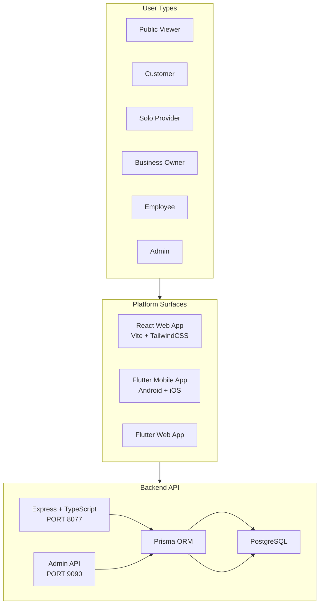

# Neighborly 2.0 — Master Roadmap

> **Version:** 2.0.0  
> **Last Updated:** 2026-05-14  
> **Status:** Living Document — update as phases complete

---

## 1. Product Vision

A social marketplace platform — part Instagram, part TaskRabbit, part Groupon.  
Regular people and businesses share content (photos/videos), discover services, negotiate terms via chat, generate AI-assisted contracts, and complete payments — all without ever sharing personal contact information.

**Core Principles:**
- **PII Protection** — No phone numbers or emails shared between users. All communication through platform chat.
- **Email Uniqueness** — One email = one account. `normalizedEmail` enforced at DB level.
- **Multi-role** — A person can be a customer, work for multiple businesses, and operate independently.
- **KYC First** — Every user must complete KYC before activation. Businesses need additional verification.
- **UI Parity** — React (web) and Flutter (mobile/web) share the same UI design based on the current dark theme on port 8077.

---

## 2. User Types

| Role | Description | KYC Required |
|------|-------------|-------------|
| `PUBLIC_VIEWER` | Unauthenticated visitor — can browse public feed and explore | No |
| `CUSTOMER` | Registered user — can book services, chat, order | Level 0 email+phone |
| `SOLO_PROVIDER` | Individual service provider — offers services under personal brand | Level 1 government ID |
| `BUSINESS_OWNER` | Company owner — manages employees, services, packages | Level 2 business docs |
| `EMPLOYEE` | Works for a business — assigned role by owner | Level 1 |
| `ADMIN` | Platform administrator — manages all users, KYC, content | N/A |

---

## 3. Platform Surfaces



---

## 4. Phase Matrix

### Phase 0 — Cleanup & Frontend Bootstrap

| Task | Status |
|------|--------|
| Delete junk files: `repoversion2/`, `temp_version2/`, `scratch/`, stale PNGs, PID files | ⏳ |
| Update `.gitignore` with `*.pid`, `*.png` exceptions, coverage artifacts | ⏳ |
| Update `docs/` folder with new ROADMAP, FEATURES, AGENTS | ⏳ |
| Update `CLAUDE.md` and `README.md` | ⏳ |
| Set up CI/CD: GitHub Actions workflow + SonarCloud config | ⏳ |
| Run Prisma migrations to sync schema with database | ⏳ |
| Fix Redis connection (optional — app works without it) | ⏳ |

---

### Phase 1 — Auth, KYC & Identity

| Feature | Status |
|---------|--------|
| JWT auth with refresh token rotation | ✅ |
| Email/password registration with normalizedEmail uniqueness | ✅ |
| Google OAuth | ✅ |
| Multi-level KYC: Level 0 email+phone, Level 1 government ID, Level 2 business docs | ✅ |
| AI-assisted KYC verification (Gemini) | ✅ |
| Admin KYC review queue | ✅ |
| Business KYC flow: sole proprietor vs corporation, license, insurance | ✅ |
| WebAuthn / Passkey support | ✅ |

---

### Phase 2 — Social Feed (Public & Personal)

| Feature | Status |
|---------|--------|
| Post creation with media upload (photo/video) | ✅ Backend |
| Post feed with pagination | ✅ Backend |
| Post reactions (like/love/laugh) | ✅ Backend |
| Post comments | ✅ Backend |
| Stories (24h expiry) | ⏳ |
| Category-based feed filtering | ⏳ |
| Save/bookmark posts | ⏳ |
| Business vs General feed tabs | ⏳ |
| Feed page in new React frontend | ⏳ |
| Feed page in Flutter | ⏳ |

---

### Phase 3 — Service Catalog & Booking Engine

| Feature | Status |
|---------|--------|
| Service catalog with categories tree | ✅ |
| Dynamic field schemas per service category | ✅ |
| Three booking modes: Fixed-price, Negotiable, Inventory-based | ✅ |
| Service packages with Bill of Materials | ✅ |
| Admin form builder for KYC per business type | ✅ |
| Booking mode lock at category level (admin override) | ✅ |

---

### Phase 4 — Order Lifecycle

| Feature | Status |
|---------|--------|
| Order creation wizard (7-step) | ✅ |
| Order status tracking: draft → submitted → matching → matched → contracted → paid → in_progress → completed | ✅ |
| Order phases: offer → order → job | ✅ |
| Order reviews and ratings | ✅ |
| Dispute handling | ✅ |
| Job records with performance metrics | ✅ |

---

### Phase 5 — Matching Engine

| Feature | Status |
|---------|--------|
| Auto-book (direct match) | ✅ |
| Round-robin provider rotation | ✅ |
| Provider eligibility scoring | ✅ |
| Offer match attempts with expiry | ✅ |
| Lost deal feedback collection | ✅ |
| Broadcast to multiple providers | ✅ |

---

### Phase 6 — Business (Provider) Dashboard

| Feature | Status |
|---------|--------|
| Provider inbox with offer management | ✅ |
| Provider schedule | ✅ |
| Provider finance (transactions) | ✅ |
| Provider inventory management | ✅ |
| Provider packages management | ✅ |
| Provider staff management | ✅ |
| Workspace switching for multi-business users | ✅ |
| Business dashboard in new React frontend | ⏳ |
| Business dashboard in Flutter | ⏳ |
| Client CRM | ⏳ |
| Invoice generation | ⏳ |

---

### Phase 7 — Chat, Contracts & Payments

| Feature | Status |
|---------|--------|
| Order-scoped chat threads | ✅ |
| PII detection and masking in chat | ✅ |
| AI-powered chat translation | ✅ |
| Contract drafting (AI from chat summary) | ✅ |
| Contract versioning and approval flow | ✅ |
| Admin contract review | ✅ |
| Payment session (post-contract) | ✅ |
| Stripe Connect integration | ⏳ |
| Payout to providers | ⏳ |
| Multi-payment method support (PayPal, Interac, Square) | ⏳ |

---

### Phase 8 — Admin Control Center

| Feature | Status |
|---------|--------|
| User CRM (segments, filters, detail) | ✅ |
| KYC review queue | ✅ |
| Form builder (per business type) | ✅ |
| Order management | ✅ |
| Contract review queue | ✅ |
| Chat moderation | ✅ |
| Payments ledger | ✅ |
| Media audit (video/photo stats) | ⏳ |
| Analytics dashboard | ⏳ |
| Public utility link management | ⏳ |
| Commission tracking (referral links) | ⏳ |
| Business trust score management | ⏳ |
| Stripe Connect overview | ⏳ |

---

### Phase 9 — Transport Layer (V2)

| Feature | Status |
|---------|--------|
| Vehicle type catalog (motorcycle → truck) | ⏳ |
| Real-time driver location tracking | ⏳ |
| Ride/delivery request flow | ⏳ |
| Driver acceptance + dispatch | ⏳ |
| Route + ETA display | ⏳ |
| Fare calculation engine | ⏳ |
| Driver rating + history | ⏳ |
| Fleet management for businesses | ⏳ |

---

## 5. Database Schema Strategy

The Prisma schema already has solid foundations (1073 lines, ~40+ models). Key models:

```
User → UserRole[] (multi-role)
Company → employees[] + clients[] + invoices[]
Post → media[] + location + interests[]
ServiceCatalog → BookingMode + inventory + dynamicFields
Order → lifecycle → Contract → Payment
JobRecord → transport extension (V2)
AuditLog → all admin actions
MediaAsset → moderation pipeline
UtilityLink → referral analytics
UserAddress → tagged locations
BusinessVerification → license + insurance
BusinessTrustScore → KYC + license + insurance + rating
Invoice → DRAFT → SENT → PAID → OVERDUE → CANCELLED
WorkspaceSocialRole → social media manager assignment
```

**Extensibility rules:**
- Never delete columns — use `archivedAt` soft-delete
- All monetary values stored as integers (cents)
- All timestamps UTC
- Media metadata stored in DB, files in object storage
- Analytics events are append-only (no updates)

---

## 6. CI/CD Standards

```yaml
GitHub Actions Workflow:
  on: [push, pull_request]
  
  jobs:
    lint:      eslint + prettier check
    typecheck: tsc --noEmit
    test:      vitest (backend + frontend) — coverage >= 70%
    sonar:     SonarCloud analysis — 0 blockers/criticals
    build:     docker build (must succeed)
    deploy:    only on main branch + all gates passed
```

**Branch strategy:**
- `main` — production-ready, protected
- `dev` — integration branch
- `feature/*` — feature branches (PR into dev)
- `hotfix/*` — emergency fixes (PR into main)

---

## 7. Quality Standards

Every PR must pass:
1. ESLint (0 errors, 0 warnings)
2. TypeScript strict mode (0 errors)
3. Unit tests (new code >= 70% coverage)
4. SonarCloud quality gate
5. Docker build success
6. One peer review approval

---

## 8. Architecture Overview

```
/
├── prisma/              ← Database schema (1073 lines, ~40+ models)
├── server.ts            ← Backend entry point (Express + TypeScript)
├── routes/              ← 37 API route files
├── lib/                 ← Shared business logic (matching, contracts, KYC, chat)
├── src/                 ← OLD React frontend (fully implemented — use as reference)
│   ├── pages/           ← Admin, Customer, Provider, Auth dashboards
│   ├── components/      ← All UI components (admin, kyc, orders, provider, crm)
│   ├── services/        ← API service layer
│   └── lib/             ← Auth context, stores, utilities
├── frontend/            ← NEW React frontend (Vite + TailwindCSS + shadcn/ui)
│   ├── src/
│   │   ├── pages/       ← Route-level pages (mostly stubs, need implementation)
│   │   ├── components/  ← Layouts + some order components
│   │   ├── services/    ← API client (7 files, partial)
│   │   └── store/       ← Zustand stores (auth, ui)
├── flutter_project/     ← Flutter mobile/web app (30+ screens)
├── docker/              ← Docker service configs
├── docs/                ← Documentation
├── files/               ← Source plan files (to be moved to docs/)
└── plans/               ← Execution plans
```

---

## 9. V2 Preview — Transport Services

Coming after core platform stability:

- Ride-hailing (motorcycle, car, van, truck)
- Package delivery
- Scheduled logistics for businesses
- Driver KYC (vehicle + license verification)
- Real-time GPS tracking
- Fare rules engine per vehicle class

Built as a first-class service type within the existing catalog/booking framework — not a separate codebase.
